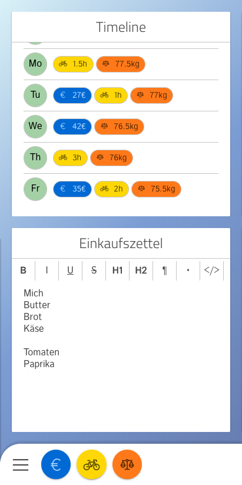

# make-your-day

Web app (React + Node) to extend my knowledge about the used technologies (React, Node, TypeScript, Apollo, Jest, webpack, ...).
It helps me measuring e.g. my expenses.

You can find all need information about the project in the docs directory.
You will find everything about:

1. [How to get started](docs/1-GettingStarted.md)
2. [The project structure](docs/1-GettingStarted.md)
3. [Best practices](docs/1-GettingStarted.md)
4. [Testing](docs/1-GettingStarted.md)
5. [The installed dependecies](docs/1-GettingStarted.md)

This app is not super complex, but in the context of the frontend, it is a great example for some best practices, like how to write reusable components, how to write tests, how to type a React App, etc.

My main focus is on frontend, the backend is very fundamental.
It is providing some basic functinality, but I will may replace the core with [postgraphile](https://www.graphile.org/postgraphile/).

## What is this app doing?

You can add categories for all the things you want to track in your daily life, like your expenses.
When creating a category, you can define what kind of information you want to track.
Does your related records have an amount? A title? A description?

After creating a category it will appear in the bottom menu.
The bottom menu is accessible on every page. When you click on a category icon in the botom menu, you will see a form for your record. This record will be related to the current day. If you want to create records for past days, you can do this with the timeline widget.

There are three widget types, the timeline, an editor for notes and an evaluation chart.
When creating a widget you can set the position in the dashboard (top or bottom).
The timeline widget will show an overview of all records created in the the last seven days.
Before you are able to create an evaluation chart widget, you need to create an evaluation.

An evaluation is useful, when you want to visualize the created records as a chart (line, bar, pie).

The last section is the settings page, you can enable the nightmode, lefthand mode and an app background image here.
